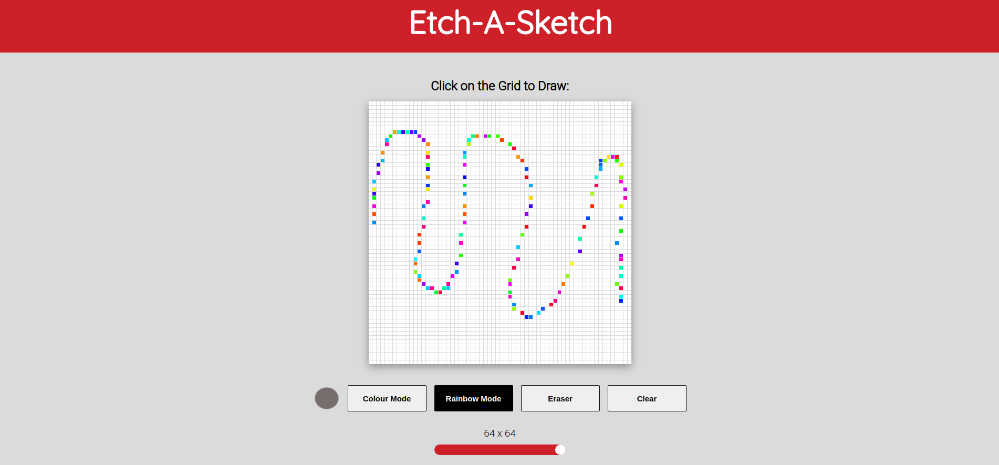

# Etch A Sketch

🔗 [View Demo](https://eternum101.github.io/etch-a-sketch/)

## Table of Contents
- [About The Project](#about-the-project)
- [Built With](#built-with)
- [Screenshots](#screenshots)
- [Features](#features)

## About The Project
A browser version of the mechanical drawing toy "Etch-A-Sketch".

## Screenshots

### Initial Screen

### Colour Mode

### Rainbow Mode

### Grid Adjustability

[Back to Top](#etch-a-sketch)

## Built With
- HTML
- CSS
- JavaScript

[Back to Top](#etch-a-sketch)

## Features

- Adjustable Grid System
- Ability to Clear Grid
- Colour Mode, Rainbow Mode & Eraser Mode
- Ability to Draw with Multiple Colours using Colour Mode

[Back to Top](#etch-a-sketch)

